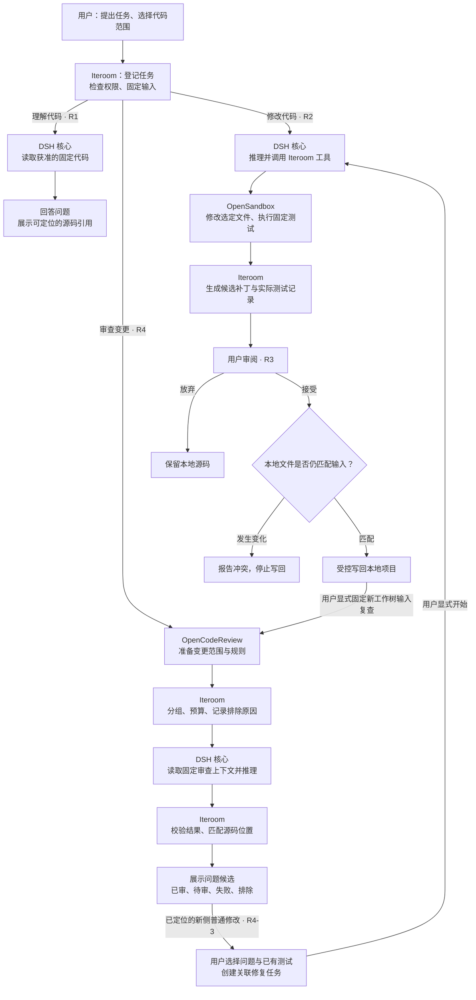

# Iteroom

**本地优先的编程助手，重点构建自己的 Harness 工程能力。**

目标是让开发者通过文字理解、修改和审查代码：助手在独立环境中执行，提供补丁与真实验证证据，用户审阅后决定是否写回项目。白色方案 C 是产品视觉基线。

> 当前仍是 DSH Web 扩展开发版。R0–R4 最小阶段退出在 Windows / 固定版本 / 合成现有文本范围内通过，R4 有真实模型 → 实际沙箱修复 → 用户接受 → 新输入复查证据。目前进入 R5，已补运行配置、预算展示与只读连接检查，详见 [R5 证据](docs/r5/EVIDENCE.md)。旧完整 DSH Web 入口仍有宿主工具；更多补丁类型、权限/数据管理、真实用户项目、干净发行和 v1 未完成。[R4 原阶段证据](docs/r4/COMPLETION-EVIDENCE.md)保留原范围，复查候选仍待人工判断。

## 职责分工

| 项目 | 在 Iteroom 中的职责 |
|---|---|
| Cordis | 组织插件、依赖和生命周期 |
| DSH 核心 | 模型推理与 Agent Loop |
| OpenCodeReview | 审查范围准备、规则参考 |
| OpenSandbox | 隔离环境中的文件操作、命令与测试执行 |
| **Iteroom 自研部分** | **任务编排、权限决策、代码快照、结果验证、用户审阅** |

目标流程：确认输入 → 隔离执行 → 检查与审查 → 导出补丁 → 冲突检查 → 用户接受或放弃。复用基础设施的同时，Iteroom 自己定义任务状态、策略、工具、证据与产品交互，不再以完整 DSH Web 产品包装作为最终架构。

v1 聚焦单用户、单项目、串行文字任务，先验证 TypeScript/Node.js 项目。语音、长期记忆、RAG 和自动策略改进不属于首版。

## 项目流程

当前有理解代码、隔离修改、变更审查三条受管流程。实线表示已经接通的流程，不代表所有真实模型/沙箱组合均已验收。Cordis 负责组织这些插件和服务的依赖、启动与释放，不是单独的任务步骤。

图中描述的是 Iteroom 受管路径；旧完整 DSH Web 开发入口仍另行保留。R0–R4 最小退出条件各有限定证据，不能推断全部产品验收通过。R4 最新演示从生产页面显式开始，经官方 DeepSeek / 原 DSH / 真实 OCR / 实际 OpenSandbox 完成关联修复、接受与新快照复查；历史两种输入另有真实 CLI 配 mock 及浏览器执行证据。详见 [当前状态](docs/STATUS.md)与 [R4 阶段验证](docs/r4/COMPLETION-EVIDENCE.md)。

### 示例：修复空数组计算平均值的问题

假设 `average.js` 使用 `sum / items.length` 计算平均值，空数组时得到 `NaN`，需求是返回 `0`。下面是流程说明，不是一次实际任务的运行报告。

1. **理解代码**：选择 `average.js`，询问为什么返回 `NaN`。Iteroom 固定文件内容，DSH 通过只读工具分析，回答并引用对应源码。
2. **审查变更**：选择工作树、单提交或提交范围。OpenCodeReview 准备清单与规则，Iteroom 分配审查预算，DSH 可能提出空数组问题候选。Iteroom 在固定源码中唯一匹配引用片段后产生行号；无法唯一匹配时显示未定位，候选仍待人工确认。
3. **隔离修改**：从已定位的新侧普通修改候选创建“空数组返回 0”的关联任务，显式选择已有测试。创建仅固定所选内容，启动后代码进入沙箱，DSH 调用 Iteroom 工具修改选定源码、运行固定测试；页面展示候选补丁和实际退出码，本地项目尚未写回。
4. **审阅并接受**：用户检查 Diff 与测试记录。接受时 Iteroom 重新核对本地内容，匹配才写回；期间编辑过目标文件则报告冲突。放弃不改源码，接受不自动 Git add、commit 或 push。
5. **新输入复查**：接受关联修改后，显式固定当前工作树全部变更；源码与测试须匹配本次接受结果，目标仍须在变更范围内。准备完成后另行开始审查，保留发现、修复任务与新报告的关系。旧审查报告不能作为修复后证据，零发现也不代表测试通过。

## 文档入口

- [产品需求](docs/PRD.md)：定位、范围、用户流程和 P0 要求。
- [目标架构](docs/ARCHITECTURE.md)：最小引擎组合、执行治理、快照与补丁流程。
- [交付路线](docs/ROADMAP.md)：R0–R5、技术 Gate 和既有代码迁移。
- [验收矩阵](docs/ACCEPTANCE.md)：真实流程、失败路径和发布门槛。
- [当前状态](docs/STATUS.md)：代码事实、可运行入口与未验证能力。
- [接续开发提示词](docs/NEXT_SESSION_PROMPT.md)：核对工作区和 R5 切片证据，继续关闭产品验收缺项。
- [R5 运行配置证据](docs/r5/EVIDENCE.md)：配置/预算、只读连接检查、超时收束和合成浏览器复验。
- [R3 接受与恢复证据](docs/r3/EVIDENCE.md)：合成脏工作树、冲突、写回检查点、恢复/回滚、历史删除与缺项。
- [R2 隔离修改证据](docs/r2/EVIDENCE.md)：真实沙箱/模型、模拟模型组合、执行故障与取消、复验和缺项。
- [R0 离线契约检查](docs/r0/DSH-CONTRACT.md)：DSH 公开接口、Profile/Patch 配置合成与未验证边界。
- [R0 运行检查](docs/r0/DSH-RUNTIME.md)：官方 CLI 真启动、自有合成只读工具、模拟循环、取消及会话恢复。
- [R0 DSH 与实际沙箱](docs/r0/DSH-SANDBOX.md)：模拟模型经实际 Loop 调用远端工具，验证错误、取消及结束/取消会话恢复。
- [R0 真实模型组合](docs/r0/DSH-LIVE.md)：官方模型经 DSH Loop 调用自有只读/实际沙箱工具，记录请求、用量、重启和清理证据。
- [R0 模型传输准备](docs/r0/MODEL-TRANSPORT.md)及[私有计数磁盘验证](docs/r0/MODEL-JOURNAL.md)：请求约束、本机 HTTP/SSE、实际文件和独立进程的前置证据。
- [R0 OCR Delegate](docs/r0/OCR-DELEGATE.md)：固定真实 CLI、三种合成 Git 输入、JSON/覆盖/失败路径与复验。
- [R0 审查输入](docs/r0/REVIEW-INPUT.md)：旧/新侧与 diff、分叉/初始/合并提交、空输入及链接边界。
- [R0 固定副本与 Gate B](docs/r0/FIXED-REVIEW-COPY.md)：限定平台内通过；保守 Git 边界及真实 CLI 证据。
- [R0 实际沙箱](docs/r0/SANDBOX-RUNTIME.md)：Linux 容器文件/测试/取消/超时/清理。
- [R0 生命周期与网络](docs/r0/SANDBOX-FAULTS.md)：TTL、控制服务重启、清理重试与带正向对照的网络策略实测。
- [R0 Gate 汇总](docs/r0/GATES.md)：Gate A/B/C 在限定环境和合成输入范围内通过；v1 产品流程仍未完成。
- [R1-1 受管任务入口](docs/r1/TASK-ENTRY.md)：版本化任务记录、请求去重、单项目串行及认证接口；任务只登记、不执行。
- [R1-2 受限文件读取](docs/r1/READ-SCOPE.md)：仅读取任务选定的本机 UTF-8 普通文件并记录内容哈希。
- [R1-3 固定输入](docs/r1/INPUT-SNAPSHOT.md)：保存选定文件的项目外副本，读时核对任务关联与哈希。
- [R1 受管只读实测](docs/r1/READONLY-LIVE.md)：独立引擎、前两轮失败、第三轮真实完成、重启与限定范围验收。
- [第三方复用](docs/DEPENDENCIES.md)：来源、接口、版本及许可证要求。
- [领域术语](CONTEXT.md) · [架构决策](docs/adr/0001-own-harness-selective-reuse.md) · [协作约定](AGENTS.md)。
- [方案 C 设计基线](docs/design-options/README.md)：白色主题、Logo 和独立通话页。

## 当前开发版源码运行

需要 Node.js 22.19+ 或 24+。在本仓库安装和构建后，用合成或隔离 Git 项目试运行：

~~~powershell
npm.cmd install --registry=https://registry.npmjs.org
npm.cmd run build
npm.cmd start -- D:\code\your-project --no-open
~~~

把示例路径换成实际目录；不传路径时使用执行目录，移除 `--no-open` 可尝试打开浏览器。独立“代码理解”面板使用本机 `DEEPSEEK_API_KEY` 或指向项目外配置的 `ITEROOM_MODEL_KEY_FILE`，不会读取 DSH Web 设置中的密钥。只有点击“固定输入并开始理解”才会发送任务选定的代码片段。当前入口仍使用固定 `@deepseek-ai/dsh@0.1.5-rc.3` 的 Web Profile 作认证页面载体；Iteroom 插件拥有受管任务/快照/权限和结果，另启最小 `sdk-minimal` 引擎。独立发行 Host 与旧开发入口替换尚未完成。

“代码理解”默认最多预留 3 次模型请求、每次最多 256 输出 tokens，可通过 `ITEROOM_MANAGED_MAX_REQUESTS`（1–4）和 `ITEROOM_MANAGED_MAX_OUTPUT_TOKENS`（1–512）调整；“隔离修改”当前每任务固定最多 4 次、每次最多 512 输出 tokens。配置无效会拒绝启动。限制按任务持久计数，不能替代服务商账单或人民币硬消费限额。DSH Web 的首次密钥提示与受管面板当前仍是两套配置流程，使用项目外 Key 时可选择“稍后配置”进入受管面板。

三个受管页面现在提供“运行配置”折叠面板：查看凭证缺失/无效/已配置、本任务的实际请求上限，以及显式检查本机沙箱连接。读取配置不调用模型；连接检查只调用固定本机服务的列表 API，不创建沙箱。“已配置”不表示账户可用，“可连接”不表示镜像或执行已验证。面板不提供凭证编辑；连接检查失败会显示原因，不替代任务开始时的 Host 校验。详见 [R5 证据](docs/r5/EVIDENCE.md)。

当前 DSH 工具可能直接操作宿主项目，不能将此开发入口视为目标隔离模式。任务审阅只比较任务前后 Git 可见文件净变化，外部编辑可能混入；模型回答不算测试证据。数据位置、旧接口及限制见 [当前状态](docs/STATUS.md)。

独立“隔离修改”面板仅对任务选定的现有 UTF-8 源文件做沙箱修改，测试文件固定；沙箱文件清单出现额外文件或链接会拒绝导出。它需要 OpenSandbox 服务、Docker Linux 后端、固定 Node 镜像以及项目外 `ITEROOM_SANDBOX_KEY_FILE`、`ITEROOM_SANDBOX_IMAGE` 配置；这些条件不会被 npm 启动器自动消除。详情见 [R2 证据](docs/r2/EVIDENCE.md)。服务不可用时受管修改失败关闭，不回退宿主执行。候选补丁可导出；用户点击接受后逐文件比较本地字节与固定输入，匹配才写回，不自动 Git add/commit。部分失败保留检查点，必须显式继续或回滚；目标再次变化时拒绝覆盖。放弃与历史删除不改项目源码。新增、删除、重命名及依赖安装还不支持，见 [R3 边界](docs/r3/EVIDENCE.md)。

## 当前开发检查

~~~powershell
npm.cmd run check
npm.cmd test
npm.cmd run build
npm.cmd run test:web
~~~

测试命令的存在不代表本轮已经执行或 v1 验收完成。真实模型、实际沙箱、Windows/Linux 部署和公开包分别验收，不用 mock 或 UI 截图替代。

2026-10-01 的 [R3 自测](docs/r3/RETEST-2026-10-01.md)发现并修复同一 Host 的重叠决策误清写回标记问题；专项 15 通过，全量 82 通过/1 Windows 条件跳过，最新代码的实际沙箱接受和合成浏览器流程通过。本次模型请求为 0，跨进程/编辑器原子性与完整 v1 未验收。

## 界面预览

[空会话](docs/screenshots/iteroom-home-desktop.png) · [语音入口](docs/screenshots/iteroom-composer-voice.png) · [桌面通话预览](docs/screenshots/iteroom-call-desktop.png) · [手机通话预览](docs/screenshots/iteroom-call-mobile.png)。

截图为已有界面资产，尚未展示目标审查/沙箱/接受补丁流程。独立通话页与麦克风、字幕、结束通话控制保持禁用，未接入语音服务。

当前按 [R5 计划](docs/r5/PLAN.md)推进完整产品验收。已接运行配置与请求预算面板；下一切片验证仓库外 tarball 安装/启动，更多补丁类型、权限/数据恢复、真实用户项目及完整发行仍待验收。旧 DSH Web 入口与宿主工具仍按原行为运行；分阶段限定证据不能外推为完整产品或 v1 验收。

关联修复仅支持已定位的新侧普通修改；当前文件整文件 Hash 必须匹配审查输入。填写修复目标并选择至少一个已有 `.test.js`、`.test.mjs` 或 `.test.cjs` 测试文件后，可创建已固定的修改任务，创建本身不调用模型。接受后可以准备新的工作树复查输入；若源文件或测试被外部编辑，或者目标修复后已无 Git 变更，会明确拒绝当前复查方式。父记录被修复/复查子记录引用时不能删除，需先处理并删除子记录。来源字段仍为 v1 可选字段，旧记录保持可读；回退前备份项目外数据，旧程序不提供新关系的删除保护。

“变更审查”面板可固定工作树、单提交或提交范围，显示测试文件纳入、删除旧侧、重命名路径和排除原因；固定后可开始审查；只有点击开始才发送已固定代码与规则给 DeepSeek。每任务最多 2 组、每组编码上下文 8 KiB、总计 16 KiB、4 次请求与每次 512 输出 tokens。超预算保持待审；遗漏/异常保留失败覆盖，零发现不代表测试通过。须在启动前设置项目外 `ITEROOM_OCR_BIN`，指向 [R4 证据](docs/r4/EVIDENCE.md)中校验值一致的官方 Windows x64 v1.12.9 可执行文件；不自动下载或执行项目内工具。固定输入无需模型或沙箱；审查推理需要项目外模型配置，审查不开放 Shell 或沙箱工具。当前保守限制为 100 个变更文件、单文件 256 KiB、两侧内容和 Diff 各 1 MiB，以及 Git 对象总量 1,000 个/16 MiB；大仓库、worktree `.git` 文件、attributes/filters/includes 等会明确拒绝。快照保存在项目外 `managed-reviews-v1`；可停止审查，结束后可删除准备/计划/报告。DSH 引擎目录和 Session 暂时独立保留，记录删除不代表全部执行历史已清除。详见 [R4-2 证据](docs/r4/INFERENCE-EVIDENCE.md)。新程序兼容旧 R1/R2/R3 记录，旧程序不能读取新增 review 任务；回退版本前备份项目外数据目录。
