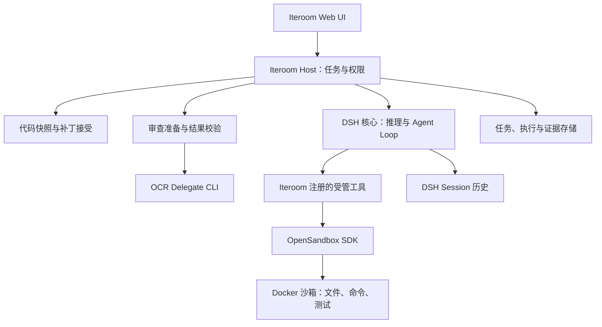

# Iteroom 目标架构

> 2026-09-26 · 目标设计；R0 技术 Gate 与 R1 受管只读退出条件已在固定环境/合成输入范围内通过，完整产品仍未完成。产品范围见 [PRD](PRD.md)，现状见 [STATUS](STATUS.md)。

## 1. 总体结构

Cordis 组织 Host 内的插件、服务及可释放资源；图中是逻辑职责，不表示最终必须拆成多个进程。模型凭证留在可信宿主，代码执行进入任务沙箱。OCR 负责准备，不在默认链路另起完整审查 Agent。

## 2. 模块职责与不变量

| 模块 | Iteroom 定义的接口职责 | 必须保持的不变量 |
|---|---|---|
| Host / TaskCoordinator | 创建、追加、暂停权限等待、取消、恢复、接受/放弃 | 单项目串行；命令请求去重；状态由实际事实推进 |
| WorkspaceManager | 固定输入、导入沙箱、导出变化、检查冲突、写回 | 不覆盖未知本地变化；不把任务前改动算作产物 |
| PermissionPolicy | 评估项目范围、网络、执行预算、补丁接受 | 在副作用之前检查；批准限定任务、动作、资源和时效 |
| EngineIntegration | 启动/驱动 DSH Agent，关联 Session，转换事件 | 只有一个推理 Loop；产品状态不污染 Session 历史 |
| SandboxExecution | 管理分配、就绪、执行、停止、核对、回收 | 每次执行归属确定 sandboxId；不静默退回宿主 |
| ReviewCoordinator | 取得 OCR 范围/规则、分组、调度、定位、合并 | 输出覆盖清单；失配/无法定位结果保留为候选 |
| EvidenceStore | 保存输入哈希、执行、审查、补丁及接受记录 | 证据关联不可变快照；可追溯失败与缺失 |
| Web UI | 项目配置、对话、任务、Diff 和用户决策 | 模型陈述不冒充检查结果；不可用功能明确禁用 |

模块接口是本项目设计目标，不是上游 SDK 名称。先实现实际需要的动作，不建立包含多个假想后端的通用框架。

## 3. DSH 最小兼容组合与启动方式

当前本地版本为 `@deepseek-ai/dsh@0.1.5-rc.3`，配套 `@deepseek-ai/cordis@4.0.2`。Agent Loop 的硬依赖为 `agents`、`sessions`、`llm`、`tools`、`systemPrompt`、`sessionProjections`。因此“只留引擎”是保留最小兼容组合，不是单独安装 Loop。

保留 Agent Loop、模型消息/流契约及必要的 Agent、Session、提示词、投影和工具运行服务。模型提供方适配可先选一个兼容实现；Session 持久化先选已验证实现。产品任务、项目、权限、具体文件/Shell 工具及证据由 Iteroom 实现。替换持久化或模型提供方时再验证契约，不为追求自研比例提前重写。

固定版 Loop 使用 `dsh-tools` 的内部 `TOOL_RUNTIME_SCHEDULER`，不能用简单自制注册表替换完整 tools 服务。优先在兼容注册服务上提供自有工具和策略；生产代码只依赖公开导出及支持的事件，内部符号只作为兼容性风险检查线索。

上游当前架构将受支持的 Node 应用启动限定为 CLI Profile 与有序 Patch/Bundle。首选用受支持入口装载 Iteroom 定义的 Cordis 插件组合及 Host；先核对固定版本允许的配置，再决定自有 Profile 或兼容最小组合。独立 `new Context()` 挂载是研究路线，注册检查不代表支持的生产启动方式。若必须脱离 launcher，需单独说明升级维护成本并验证，不默认复制 Loop 或深度 fork。

阶段退出条件包括：真实模型 → 自有只读工具 → 沙箱修改 → 测试 → 停止 → 重启恢复，而非只证明插件可注册。模型工具不得留下绕过 Iteroom 策略的宿主执行入口。来源：[DSH 架构](https://github.com/deepseek-ai/deepseek-harness/blob/master/docs/architecture.md)、[Agent Loop](https://github.com/deepseek-ai/deepseek-harness/blob/master/packages/core/agent-loop/README.md)。上游 master 文档与固定版实现分别核对。

2026-09-27 的 [R0 离线切片](r0/DSH-CONTRACT.md)已核对公开导出并合成候选配置；后续[运行切片](r0/DSH-RUNTIME.md)通过官方 CLI 真启动，在禁用宿主执行项和真实模型适配器后完成合成只读工具/模拟模型循环、guard 拒绝、错误、Agent 取消与已结束 Session 恢复。[实际沙箱工具组合](r0/DSH-SANDBOX.md)复用同一 CLI 辅助接口，工具仅固定动作，实际 SDK 执行/返回/错误/父子收束与结束/取消会话恢复已验。取消前核对父子存活，停止只接受 ENOENT/僵尸；资源清单未捕获不能确认删除，归属日志与控制服务保留。2026-09-28 的[真实模型组合](r0/DSH-LIVE.md)补齐官方适配器经原 Loop 调用只读/沙箱工具、接收实际测试结果及重启不重放，在固定环境的 Gate A 范围内通过；产品未知执行恢复和真实提供方故障/取消仍未验。

固定版 SDK 仅支持 initialize、session/prompt、shutdown，没有单任务取消 RPC，已有 sessionId 的 prompt 仍尝试 create 并报已存在。运行切片分别验证核心公开 Agent.cancel/whenIdle 与 agents.resume；目标 Host 应明确驱动创建、恢复与取消，并独立核对远端执行。DSH Session 恢复不能替代产品任务和副作用恢复。

R1 的[受管只读链路](r1/READONLY-LIVE.md)已由 Iteroom Host 插件为每个任务创建独立 `sdk-minimal` CLI/`DSH_HOME`，Patch 禁用宿主文件修改与 Shell/进程工具，只注册 `iteroom_read_snapshot`。Host 先固定选定文本，工具每次按任务/清单/哈希读取，DSH 仍拥有原 Agent Loop 和 Session；任务记录保存 `taskId=sessionId`、状态、来源与事件游标。官方模型适配器的公开 `prepareCall` 流经子进程第 4 管道转发文本增量，Host 限额、持久化并轮询展示未核实草稿；真实模型已产生服务端增量，但浏览器生成中间帧显示待验。进程取消需等待退出，重启不重发同一任务；Windows 合成强制结束 Host 后 CLI 退出、任务转 interrupted 的故障注入通过，不外推真实提供方或其他平台。前两轮真实模型失败后修正返回范围裁剪/行数提示；第三轮用 2 次真实请求完成准确回答和固定引用，重启后未重发且合成仓库未变，故 R1 的受管只读退出条件在声明范围内通过。现有 Web Profile 仍作为认证页面载体并保留旧完整开发入口；独立发行 Host 尚未完成，不能声称全量 Web Profile 已只读。

受管任务默认每任务最多预留 3 次请求、每次最多 256 输出 tokens；Host 可用 `ITEROOM_MANAGED_MAX_REQUESTS`（1–4）与 `ITEROOM_MANAGED_MAX_OUTPUT_TOKENS`（1–512）在启动时显式收紧或提高上限，子进程和发送前守卫取同一值。无效配置拒绝启动。计数按任务持久化，不能作为提供方账单或人民币硬消费限额。

## 4. OpenCodeReview 接入

以进程调用 `ocr delegate preview --format json` 和 `ocr delegate rule <path...> --format json`，显式传入受管仓库/快照上下文。CLI 使用参数数组调用、固定可执行文件和版本，限制时长与输出。解析 schema version、字段及路径，不相信输出路径天然安全。

工作树模式在受管临时 Git 仓库中表示输入变更；提交/范围模式取得用户指定的准确修订及必要历史。不向沙箱直接挂载宿主 `.git`。如何构造这些输入是 Gate B 的接口验证项，不假定 Delegate 支持任意内存快照。

Delegate 只提供候选清单、排除原因和规则。同规则分组不等于语义依赖分组；上下文预算、diff 获取、审查推理、覆盖记录、代码定位及合并由 Iteroom 负责。上游默认排除的测试源码需要按任务补充；所有排除项可见。

定位需比对固定快照中的文件和片段，重命名/删除需显示变更侧。找不到或存在多个匹配时不能伪造行号。模型过滤只影响候选质量，不能替代复现/测试证据。审查结果保存 OCR 版本、规则来源及规则哈希。完整 OCR 审查模式只作对照，不自动成为第二个主运行时。

研究快照为 `486022daaf14f7142275eddb9b3cacc3cc5dadfa`。2026-09-27 的[独立探针](r0/OCR-DELEGATE.md)固定官方 v1.12.9（源提交 bccbc15f），校验 Windows amd64 二进制 SHA256 与实际版本。schema_version 严格为字符串 `"1"`，模式/修订/merge-base 和全部文件与独立 Git 清单比对；测试显式 include、规则覆盖及真实错误有证据。preview 删除默认排除，重命名不返回旧路径，须补充旧侧定位；正式快照接线仍未完成。进程参数数组、受控 HOME/USERPROFILE、时限/合并输出限额、进程树收束仅是 R0 执行边界，未改变原产品工具行为。

2026-09-27 的[输入捕获扩展](r0/REVIEW-INPUT.md)只在受管合成仓库提供旧/新路径、Git blob/内容/diff 哈希与固定文本。range 使用唯一 merge-base，root 对空树，merge commit 对第一父；多最佳祖先/无共同历史拒绝。文本删除获得 old side 和规则但保持 pending_inference；binary/provider 排除可见，测试显式纳入。后续[固定副本](r0/FIXED-REVIEW-COPY.md)重建独立 objects/index/字节，CLI 改读副本并前后复验；配置/attributes 与外部存储保守拒绝。捕获不是原子的、副本未受 OS 只读保护，该 R0 模块不得直接接真实项目作为产品 WorkspaceManager。

## 5. OpenSandbox 接入

使用 TypeScript SDK `@alibaba-group/opensandbox`，固定并记录实际验证的 SDK、服务与镜像 digest。首版只接 Docker，不引入预热池、Kubernetes 或微虚拟机调度。研究源码快照为 `4a5619524650ff7c2cbaf59626df822fce72b161`，不等同选定发行版本。

沙箱创建是异步的，先记录分配再等待就绪/健康检查。每任务独立环境；只传入过滤后的快照，不以可写挂载直接暴露用户项目、用户目录或 Docker socket。依赖缓存只能按明确策略使用，缓存可写性与跨任务污染需验证。

命令记录执行 ID、argv 或 shell 形式、cwd、预算、流输出、退出码及环境。参数来自非可信输入时优先 literal argv；允许 Shell 的任务仍受权限与沙箱策略限制。命令失败不改写成模型回答中的“成功”。

取消先停止模型调度，再发远端 interrupt/必要销毁并查询最终状态。前台/后台断线语义分别验证；HTTP 请求结束、SDK Abort 或按钮变色都不足以单独证明远端停止。`close()` 只关客户端资源，`kill()` 请求删除沙箱；清理失败记录为待回收资源并重试核对。

沙箱暂停/恢复按后端能力使用，不等同产品任务恢复；保存文件系统也不必然保存进程或内存。沙箱消失时可从快照重建环境，不能盲目重放未确认命令。

网络模式显式配置：固定版配置类默认 host，而示例使用 bridge，不能依赖默认值。默认使用受限 bridge 和显式网络策略；DNS 过滤不等同数据包拦截，强化运行时与 egress 的兼容性单独验证。增强隔离选项可能需要额外权限，不以功能名称推断安全强度。部署诊断记录 active/degraded/unsupported；能力不足时拒绝需要该能力的任务。

Windows 宿主优先验证 Docker/WSL2 上的 Linux 执行环境；路径、换行、文件位与依赖差异都属于验收范围。Windows 客体 profile 是另一个 KVM/QEMU 路线，不纳入 v1。

独立[实际探针](r0/SANDBOX-RUNTIME.md)已安装 npm SDK 1.1.0、固定源码服务及 digest 镜像并验证基本链路。固定 execd v1.1.0 要求 command，不能使用 SDK 的 argv JSON；容器内使用逐参数 POSIX 引号转换并实测字面值。文件 mode 要传 755/644 数字，JS 0o755 被串行为 493 后拒绝。端口范围须至少 100 个。[生命周期探针](r0/SANDBOX-FAULTS.md)使用至少 60 秒 TTL；API 404 后仍等待容器/卷消失。创建超时保留 owner/未确认状态和控制服务，不能把应用容器暂未出现当作未分配。网络证据含同一公开 IPv4 目标 DNS/TCP 443 正向对照；降级拒绝有离线测试，全部协议/宿主端点隔离未验。以上限制未改变产品 API，DSH 沙箱工具尚未接线。

来源：[平台架构](https://github.com/opensandbox-group/OpenSandbox/blob/4a5619524650ff7c2cbaf59626df822fce72b161/docs/architecture/index.md)、[SDK](https://github.com/opensandbox-group/OpenSandbox/blob/main/sdks/sandbox/javascript/README.md)、[运行时](https://github.com/opensandbox-group/OpenSandbox/blob/main/docs/guides/secure-container.md)、[Windows 客体](https://github.com/opensandbox-group/OpenSandbox/blob/4a5619524650ff7c2cbaf59626df822fce72b161/docs/guides/windows-sandbox.md)。

## 6. 数据与接口约定

目标标识为 projectId、taskId、sessionId、snapshotId、sandboxId、executionId、artifactId、requestId。产品任务对 DSH Session/turn 显式关联；一个任务可包含多个 turn，不能默认一轮回答就是完整任务。

| 记录 | 保存内容 | 权威来源 |
|---|---|---|
| Task | 目标、输入、状态、策略、关联 Session/快照/沙箱 | Iteroom 产品记录 |
| InputSnapshot | 文件清单、类型/哈希、基线修订、排除项 | 固定的受管输入 |
| Execution | 执行动作、远端 ID、状态、日志游标、退出码 | 实际执行器事实 |
| Finding | 问题依据、定位状态、规则来源、复现关联 | 审查候选与校验记录 |
| Artifact | 补丁、输入/输出哈希、验证索引 | 固定沙箱产物 |
| Acceptance | 用户决策、写回前后哈希、恢复信息 | 宿主实际写回记录 |
| Session | 模型/工具对话事件 | DSH 历史 |

Task、Execution、Artifact 等完整产品记录仍拟存项目外 SQLite；大日志/快照/补丁存受管文件目录，以哈希关联。DSH Session 先保留兼容持久化实现。当前 R1 的[受管任务入口](r1/TASK-ENTRY.md)存项目外 `managed-tasks-v1` JSON：任务元数据、读取摘要、快照关联、受管引擎状态、已校验引用及最多 32 条单调事件；独占锁与同目录替换保护写入。旧记录缺新增字段时兼容读取，不迁移或删除旧 DSH 任务证据。该有限 JSON 文件不是完整产品存储。

产品 API 目标动作是创建任务、追加输入、获取详情/事件、批准权限、取消、接受/放弃及删除历史。写动作带 requestId；权限票据不能由模型生成。确切 HTTP 路径/schema 在对应切片实现时冻结，现有只读接口不会被本文假称为完整产品 API。

R1-1 切片冻结 `GET /api/iteroom/managed-tasks[?taskId=...]` 与 `POST /api/iteroom/managed-tasks/create`。现有 DSH Connection 承载认证和来源检查；创建路由另核对 Host/Origin 并流式限制 8 KiB。客户端不能选择项目根。该段只描述登记切片；当前启动动作与模型调用见[受管只读实测](r1/READONLY-LIVE.md)。

R1-2 新增 `POST /api/iteroom/managed-tasks/read`，只接受已选文件，并在读取前后检查普通文件、真实路径、符号/硬链接、大小与文件身份；每文件最多 256 KiB，严格 UTF-8。响应正文只回到本机已认证的 Web 请求；项目外 Store 持久化 SHA-256/行数/字节数，重复内容幂等，变化拒绝。读取与路径检查不是 OS 原子操作，该历史切片的摘要也不保存原始字节；R1-3 已补固定副本。没有修改旧 DSH 宿主工具的权限。

R1-3 新增 `POST /api/iteroom/managed-tasks/snapshot`：从受限读取固定任务选定文本至项目外目录，持久化清单哈希 `snapshotId`。当前独立引擎只通过 `readManagedSnapshotFile` 并按文件哈希复核副本；损坏不回退当前工作树。此为应用层固定输入，多文件采集非 OS 原子；旧 Web Profile 仍有宿主工具。

事件以 taskId + 递增 seq 关联并支持游标重连；持久化事实后再发布。重复事件幂等投影，客户端游标不足时拉取完整状态。跨进程无 exactly-once 保证：副作用按 executionId 和实际状态核对；不确定时转 interrupted 而非自动重试。

## 7. 工作区写回与恢复

输入快照保留允许文件的任务前真实内容及哈希，包括已确认的脏工作树内容。未跟踪内容、忽略文件、符号链接、子模块、LFS、二进制和超大文件分别分类；v1 未支持的类别拒绝修改或明确仅导出，不默默遗漏。

导出补丁先校验路径、类型、变更侧和体积。接受前锁定本项目写回流程，重新核对目标文件；文件未改变时写入，变化时报告冲突。该锁不阻止用户编辑器，逐文件写入前仍须重核，防止检查后变化。

跨多个文件不承诺单一原子事务。先保存目标文件可恢复副本与写回日志，再受控执行；中断时识别已写/未写项。恢复或回滚只在目标仍匹配本次已写哈希时执行，避免覆盖中途用户编辑。Git index 不自动修改，自动 commit/push 不在流程内。

## 8. 安全与技术验证门槛

R0 独立[模型请求守卫](r0/MODEL-TRANSPORT.md)在 fetch 前限制固定端点/model、文本请求/无日志扩展、六次请求/输出上限；commit 成功后才发 HTTP，失败/取消不返还次数，禁止重定向。只经过离线与回环官方 adapter 协议测试；后续[私有磁盘计数](r0/MODEL-JOURNAL.md)已在受管目录/独立进程验证提交、重开、锁和写失败；用户已指定 DeepSeek 官方 deepseek-flash，真实适配器接线与金额约束待明确调用/费用授权后实施，不能称为产品预算/真实模型验收。

Host 负责身份/来源校验、权限审批、路径真实解析、凭证过滤、预算和日志脱敏；OpenSandbox 提供实际部署的隔离机制。把这两者都验证后才声明受控执行。

默认限制模型步数、任务时间、单命令时间、文件量、日志量及网络；具体值通过 PoC 测量后冻结并在 UI 可见。禁止模型自批权限或偷偷扩大策略。只读宿主文件工具也要处理 symlink/junction 越界。

三个先行 Gate：DSH 支持的最小启动/工具挂载；OCR 三种审查输入和 JSON 契约；OpenSandbox 本机运行、取消和清理。任一失败，暂停相应主链路迁移并记录具体问题，不用 mock 冒充验证通过。

许可归属见 [第三方依赖](DEPENDENCIES.md)，行为验收见 [ACCEPTANCE](ACCEPTANCE.md)。
